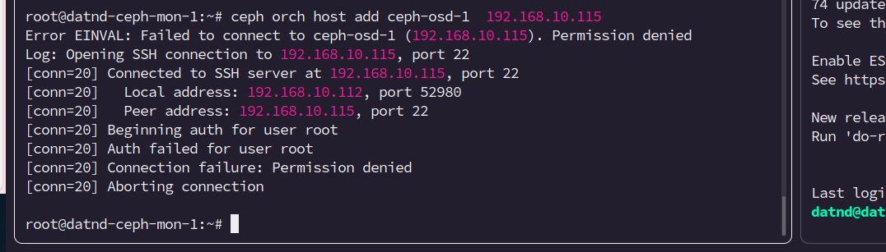

# Cài đặt Ceph cluster

### Prerequiste 

- 3 node for ceph-OSD and 3 node cho ceph-MON

```golang
ceph-mon-1 192.168.10.112   
ceph-mon-2 192.168.10.113
ceph-mon-3 192.168.10.114

ceph-osd-1 192.168.10.115
ceph-osd-2 192.168.10.116
ceph-osd-3 192.168.10.117
```

> Có thể tạo 1 node riêng làm admin nhưng ở đây lấy luôn node ceph-mon-1 làm admin. Đảm bảo rằng node admin có thể ssh qua các node còn lại = user root ở port 22 

- Các node ceph-osd phải có 1 ổ cứng raw

```css
root@datnd-ceph-osd-3:~# lsblk -l
NAME                                             MAJ:MIN RM  SIZE RO TYPE MOUNTPOINTS
loop0                                              7:0    0 63.7M  1 loop /snap/core20/2434
loop1                                              7:1    0 63.7M  1 loop /snap/core20/2496
loop2                                              7:2    0   87M  1 loop /snap/lxd/27037
loop3                                              7:3    0 89.4M  1 loop /snap/lxd/31333
loop4                                              7:4    0 44.4M  1 loop /snap/snapd/23545
loop5                                              7:5    0 44.4M  1 loop /snap/snapd/23771
sda                                                8:0    0   20G  0 disk 
sda1                                               8:1    0    1M  0 part 
sda2                                               8:2    0   20G  0 part /
sdb                                                8:16   0   20G  0 disk 
sr0                                               11:0    1    2G  0 rom  
```

### Cài đặt ceph

2. Follow các bước sau:


- Cài đặt python3 và docker trên tất cả các node

- Cài đặt ceph admin
```bash   
apt install -y cephadm

```
- Khởi tạo ceph admin

```bash

cephadm bootstrap --mon-ip 192.168.10.112   


```
- Cài đặt ceph-cli

```bash 

cephadm add-repo --release reef
cephadm install ceph-common

```

- Add các hosts còn lại vào cluster

```bash 
ceph orch host add datnd-ceph-mon-2 192.168.10.113
ceph orch host add datnd-ceph-mon-3 192.168.10.114
ceph orch host add datnd-ceph-osd-1 192.168.10.115
ceph orch host add datnd-ceph-osd-2 192.168.10.116
ceph orch host add datnd-ceph-osd-3 192.168.10.117
```


> Trường hợp add hosts mà báo lỗi sau:



**Chạy lệnh sau:**

- Copy ssh key gen bởi ceph admin vào các node còn lại để có thể join vào cluster

```bash
sudo ssh-copy-id -f -i /etc/ceph/ceph.pub root@192.168.10.113 

...

sudo ssh-copy-id -f -i /etc/ceph/ceph.pub root@192.168.10.117
```


### Test provision k8s


1.  Tải chart:

```bash 
kubectl create ns ceph

helm repo add ceph-csi https://ceph.github.io/csi-charts

helm pull ceph-csi/ceph-csi-cephfs

```
2. Lấy thông tin về cụm ceph:


```bash

ceph config generate-minimal-conf > ceph-minimal.conf

cat ceph-minimal.conf
__________________________________________________________________
        # minimal ceph.conf for e70c696a-049c-11f0-aaf6-c1a94ea2f0e2
        [global]
                fsid = e70c696a-049c-11f0-aaf6-c1a94ea2f0e2
                mon_host = [v2:192.168.10.112:3300/0,v1:192.168.10.112:6789/0] [v2:192.168.10.113:3300/0,v1:192.168.10.113:6789/0] [v2:192.168.10.114:3300/0,v1:192.168.10.114:6789/0]
__________________________________________________________________

ceph auth get-key client.admin

QVFDWDNuVmtNV3NvSlJBQUFvazIxMCszZXFxNmF6SmpT5WJjaUE9PQ==

```


3. Tạo volume, subvolumegroup:

```bash 
# tạo volume có tên k8s-storage ở các node OSD
ceph fs volume create k8s-storage --placement="3 datnd-ceph-osd-01 datnd-ceph-osd-02 datnd-ceph-osd-03"

# tạo subvolume có tên csitrong volume k8s-storage

ceph fs subvolume create k8s-storage csi 

```

4. Sửa các fields sau trong values.yaml :

```bash

csiConfig: 
  - clusterID: e70c696a-049c-11f0-aaf6-c1a94ea2f0e2
    monitors:
      - 192.168.10.112:6789 # IP các node ceph-MON
      - 192.168.10.113:6789
      - 192.168.10.114:6789
    cephFS:
      subvolumeGroup: "csi" # tên subvolume
___

storageClass:
  create: true
  name: csi-cephfs-sc
  clusterID: e70c696a-049c-11f0-aaf6-c1a94ea2f0e2 # đổi thành cluster id
  fsName: k8s-storage # tên volume đã tạo ở trên

___

secret:
  create: true
  name: csi-cephfs-secret
  annotations: {}
  adminID: admin   
  adminKey: AQB6gdpnLhE+DBAAd7V/LN7XiuoR6qKVsJfFrg==   # key vừa lấy ở trên
  userID: ""
  userKey: ""

```

5. Tải helm chart 

```bash 
helm install  ceph-csi -f values.yaml ceph-csi-cephfs -n ceph
```


### Cài Đặt ceph rados gateway

1. Lấy các node OSD chạy RGW service:

```bash 
ceph orch apply rgw default --placement="3 datnd-ceph-osd-1 datnd-ceph-osd-2 datnd-ceph-osd-3" --port=8080
ceph orch host label add datnd-ceph-osd-1  rgw
ceph orch host label add datnd-ceph-osd-2  rgw
ceph orch host label add datnd-ceph-osd-3  rgw
ceph orch host ls

Output______________________________________________

HOST              ADDR            LABELS      STATUS  
datnd-ceph-mon-1  192.168.10.112  _admin,mgr          
datnd-ceph-mon-2  192.168.10.113  mon,mgr             
datnd-ceph-mon-3  192.168.10.114  mon,mgr             
datnd-ceph-osd-1  192.168.10.115  osd,rgw             
datnd-ceph-osd-2  192.168.10.116  osd,rgw             
datnd-ceph-osd-3  192.168.10.117  osd,rgw             
6 hosts in cluster
```

2. Tạo rados gateway cho tren các node OSD

```bash 
ceph orch apply rgw foo '--placement=label:rgw count-per-host:3' --port=8000 # thay đổi số lượng các hosts rgw qua count tùy theo nhu cầu
```


3. Tạo bucket user
```bash
radosgw-admin user create --uid="admin" --display-name="RGW_Admin" > rgw_admin.ttx

Output______________________________________________

{
    "user_id": "admin",
    "display_name": "RGW_Admin",
    "email": "",
    "suspended": 0,
    "max_buckets": 1000,
    "subusers": [],
    "keys": [
        {
            "user": "admin",
            "access_key": "6GJJGEVQ0EPF3DE62EKY",
            "secret_key": "4UCRaPgWQGDRNwr8uXGJAg8zOIVimlNDVAedkCBV"
        }
    ],
    "swift_keys": [],
    "caps": [],
    "op_mask": "read, write, delete",
    "default_placement": "",
    "default_storage_class": "",
    "placement_tags": [],
    "bucket_quota": {
        "enabled": false,
        "check_on_raw": false,
        "max_size": -1,
        "max_size_kb": 0,
        "max_objects": -1
    },
    "user_quota": {
        "enabled": false,
        "check_on_raw": false,
        "max_size": -1,
        "max_size_kb": 0,
        "max_objects": -1
    },
    "temp_url_keys": [],
    "type": "rgw",
    "mfa_ids": []
}
```


4. Cài đặt awscli

```bash
apt install awscli -y 
```

5. Thử push file lên bucket

```bash
aws configure 
# Tạo bucket
aws --endpoint-url=http://datnd-ceph-osd-1:8080 s3 mb s3://ceph1 

# Push object lên bucket
aws --endpoint-url=http://192.168.10.115:8080 s3 cp /root/init.sql  s3://ceph1
aws --endpoint-url=http://192.168.10.115:8080 s3 cp /root/rgw_admin.txt  s3://ceph1

# Kiểm tra
aws --endpoint-url=http://192.168.10.115:8080 s3 ls s3://ceph1

Output____________________________________________

2025-03-21 03:08:14    4611041 init.sql
2025-03-21 03:03:23        880 rgw_admin.txt
```