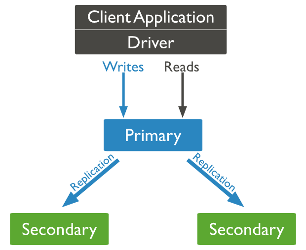
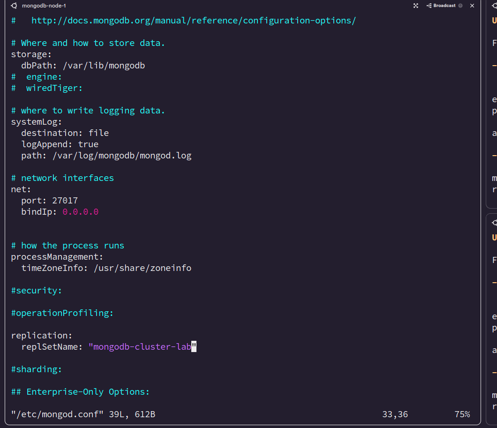
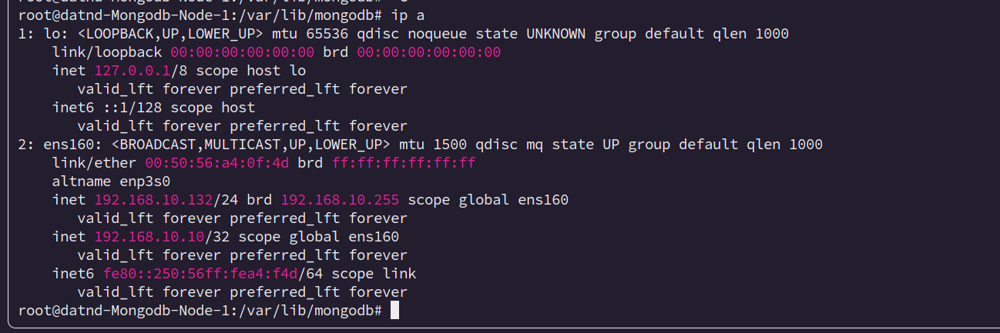
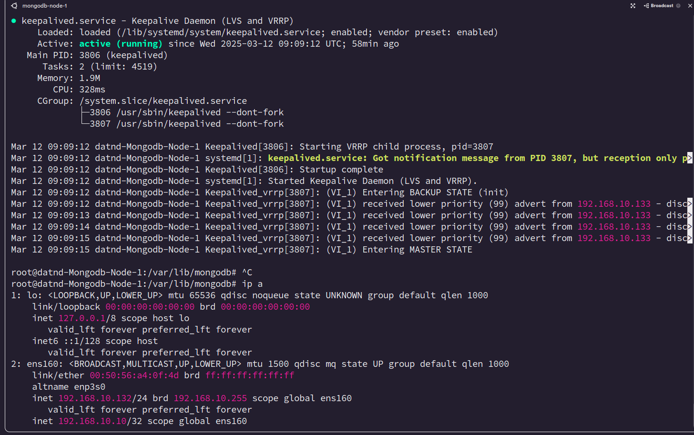
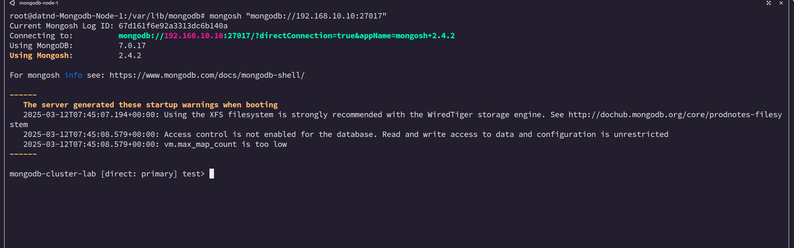

# Cài đặt MongoDb Replica 




1. Chuẩn bị 3 server, ví dụ có 3 node:

```bash
node1: 192.168.10.132
node2: 192.168.10.133
node3: 192.168.10.134

```
- Tiến hành add hosts vào các server (chạy lệnh trên cả 3 node)

```bash 
sudo tee -a /etc/hosts <<EOF
192.168.10.132 mongodb-node-1  
192.168.10.133 mongodb-node-2
192.168.10.134 mongodb-node-3
EOF

```

- Cài đặt các công cụ cần thiết (ta sẽ cài mongo 7):

```bash
apt install software-properties-common gnupg apt-transport-https ca-certificates -y

curl -fsSL https://pgp.mongodb.com/server-7.0.asc | sudo gpg -o /usr/share/keyrings/mongodb-server-7.0.gpg --dearmor

echo "deb [ arch=amd64,arm64 signed-by=/usr/share/keyrings/mongodb-server-7.0.gpg ] https://repo.mongodb.org/apt/ubuntu jammy/mongodb-org/7.0 multiverse" | sudo tee /etc/apt/sources.list.d/mongodb-org-7.0.list

apt update

apt install mongodb-org -y
```


- Tiếp tục cấu hình truy cập đến mongodb:


```bash

vi /etc/mongod.conf

# Tìm và sửa 2 phần này trong file 


 bindIp: 0.0.0.0

replication:
  replSetName: "mongodb-cluster" #tên tùy chọn

```


- Restart và check mongodb service:

```bash 

systemctl restart mongod
systemctl status mongod


```


2. Cài đặt replica:

- Chạy trên 1 server bất kỳ, ở đây ta chọn server 1:


```bash
mongosh

test> rs.initiate( {
      _id : "mongodb-cluster-lab",
      members: [
         { _id: 0, host: "mongodb-node-1:27017" }, # có thể thay = IP nếu chưa add hosts ở step 1
         { _id: 1, host: "mongodb-node-2:27017" },
         { _id: 2, host: "mongodb-node-3:27017" }
      ]
   })


mongodb-cluster-lab [direct: primary] test> rs.status() # chạy lệnh này để kiểm tra status của replica 


{
  set: 'mongodb-cluster-lab',
  date: ISODate('2025-03-12T09:57:36.066Z'),
  myState: 1,
  term: Long('2'),
  syncSourceHost: '',
  syncSourceId: -1,
  heartbeatIntervalMillis: Long('2000'),
  majorityVoteCount: 2,
  writeMajorityCount: 2,
  votingMembersCount: 3,
  writableVotingMembersCount: 3,
  optimes: {
    lastCommittedOpTime: { ts: Timestamp({ t: 1741773451, i: 1 }), t: Long('2') },
    lastCommittedWallTime: ISODate('2025-03-12T09:57:31.726Z'),
    readConcernMajorityOpTime: { ts: Timestamp({ t: 1741773451, i: 1 }), t: Long('2') },
    appliedOpTime: { ts: Timestamp({ t: 1741773451, i: 1 }), t: Long('2') },
    durableOpTime: { ts: Timestamp({ t: 1741773451, i: 1 }), t: Long('2') },
    lastAppliedWallTime: ISODate('2025-03-12T09:57:31.726Z'),
    lastDurableWallTime: ISODate('2025-03-12T09:57:31.726Z')
  },
  lastStableRecoveryTimestamp: Timestamp({ t: 1741773411, i: 1 }),
  electionCandidateMetrics: {
    lastElectionReason: 'stepUpRequestSkipDryRun',
    lastElectionDate: ISODate('2025-03-12T08:56:41.613Z'),
    electionTerm: Long('2'),
    lastCommittedOpTimeAtElection: { ts: Timestamp({ t: 1741769792, i: 1 }), t: Long('1') },
    lastSeenOpTimeAtElection: { ts: Timestamp({ t: 1741769792, i: 1 }), t: Long('1') },
    numVotesNeeded: 2,
    priorityAtElection: 1,
    electionTimeoutMillis: Long('10000'),
    priorPrimaryMemberId: 1,
    numCatchUpOps: Long('0'),
    newTermStartDate: ISODate('2025-03-12T08:56:41.622Z'),
    wMajorityWriteAvailabilityDate: ISODate('2025-03-12T08:56:41.647Z')
  },
  electionParticipantMetrics: {
    votedForCandidate: true,
    electionTerm: Long('1'),
    lastVoteDate: ISODate('2025-03-12T07:55:02.673Z'),
    electionCandidateMemberId: 1,
    voteReason: '',
    lastAppliedOpTimeAtElection: { ts: Timestamp({ t: 1741766092, i: 1 }), t: Long('-1') },
    maxAppliedOpTimeInSet: { ts: Timestamp({ t: 1741766092, i: 1 }), t: Long('-1') },
    priorityAtElection: 1
  },
  members: [
    {
      _id: 0,
      name: '192.168.10.132:27017',
      health: 1,
      state: 1,
      stateStr: 'PRIMARY',
      uptime: 7949,
      optime: { ts: Timestamp({ t: 1741773451, i: 1 }), t: Long('2') },
      optimeDate: ISODate('2025-03-12T09:57:31.000Z'),
      lastAppliedWallTime: ISODate('2025-03-12T09:57:31.726Z'),
      lastDurableWallTime: ISODate('2025-03-12T09:57:31.726Z'),
      syncSourceHost: '',
      syncSourceId: -1,
      infoMessage: '',
      electionTime: Timestamp({ t: 1741769801, i: 1 }),
      electionDate: ISODate('2025-03-12T08:56:41.000Z'),
      configVersion: 2,
      configTerm: 2,
      self: true,
      lastHeartbeatMessage: ''
    },
    {
      _id: 1,
      name: '192.168.10.133:27017',
      health: 1,
      state: 2,
      stateStr: 'SECONDARY',
      uptime: 3518,
      optime: { ts: Timestamp({ t: 1741773451, i: 1 }), t: Long('2') },
      optimeDurable: { ts: Timestamp({ t: 1741773451, i: 1 }), t: Long('2') },
      optimeDate: ISODate('2025-03-12T09:57:31.000Z'),
      optimeDurableDate: ISODate('2025-03-12T09:57:31.000Z'),
      lastAppliedWallTime: ISODate('2025-03-12T09:57:31.726Z'),
      lastDurableWallTime: ISODate('2025-03-12T09:57:31.726Z'),
      lastHeartbeat: ISODate('2025-03-12T09:57:35.810Z'),
      lastHeartbeatRecv: ISODate('2025-03-12T09:57:35.809Z'),
      pingMs: Long('0'),
      lastHeartbeatMessage: '',
      syncSourceHost: '192.168.10.134:27017',
      syncSourceId: 2,
      infoMessage: '',
      configVersion: 2,
      configTerm: 2
    },
    {
      _id: 2,
      name: '192.168.10.134:27017',
      health: 1,
      state: 2,
      stateStr: 'SECONDARY',
      uptime: 7364,
      optime: { ts: Timestamp({ t: 1741773451, i: 1 }), t: Long('2') },
      optimeDurable: { ts: Timestamp({ t: 1741773451, i: 1 }), t: Long('2') },
      optimeDate: ISODate('2025-03-12T09:57:31.000Z'),
      optimeDurableDate: ISODate('2025-03-12T09:57:31.000Z'),
      lastAppliedWallTime: ISODate('2025-03-12T09:57:31.726Z'),
      lastDurableWallTime: ISODate('2025-03-12T09:57:31.726Z'),
      lastHeartbeat: ISODate('2025-03-12T09:57:35.811Z'),
      lastHeartbeatRecv: ISODate('2025-03-12T09:57:35.810Z'),
      pingMs: Long('0'),
      lastHeartbeatMessage: '',
      syncSourceHost: '192.168.10.132:27017',
      syncSourceId: 0,
      infoMessage: '',
      configVersion: 2,
      configTerm: 2
    }
  ],
  ok: 1,
  '$clusterTime': {
    clusterTime: Timestamp({ t: 1741773451, i: 1 }),
    signature: {
      hash: Binary.createFromBase64('AAAAAAAAAAAAAAAAAAAAAAAAAAA=', 0),
      keyId: Long('0')
    }
  },
  operationTime: Timestamp({ t: 1741773451, i: 1 })
}
mongodb-cluster-devopseduvn [direct: primary] test> rs.isMaster() # chạy để check xem node hiện tại có phải Primary hay ko


  setName: 'mongodb-cluster-lab',
  setVersion: 2,
  ismaster: true,
  secondary: false,
  primary: '192.168.10.132:27017',
  me: '192.168.10.132:27017',
  electionId: ObjectId('7fffffff0000000000000002'),
  lastWrite: {
    opTime: { ts: Timestamp({ t: 1741773541, i: 1 }), t: Long('2') },
    lastWriteDate: ISODate('2025-03-12T09:59:01.000Z'),
    majorityOpTime: { ts: Timestamp({ t: 1741773541, i: 1 }), t: Long('2') },
    majorityWriteDate: ISODate('2025-03-12T09:59:01.000Z')
  },
  maxBsonObjectSize: 16777216,
  maxMessageSizeBytes: 48000000,
  maxWriteBatchSize: 100000,
  localTime: ISODate('2025-03-12T09:59:09.821Z'),
  logicalSessionTimeoutMinutes: 30,
  connectionId: 207,
  minWireVersion: 0,
  maxWireVersion: 21,
  readOnly: false,
  ok: 1,
  '$clusterTime': {
    clusterTime: Timestamp({ t: 1741773541, i: 1 }),
    signature: {
      hash: Binary.createFromBase64('AAAAAAAAAAAAAAAAAAAAAAAAAAA=', 0),
      keyId: Long('0')
    }
  },
  operationTime: Timestamp({ t: 1741773541, i: 1 }),
  isWritablePrimary: true
}

```


- Tạo thử data để test (chạy trên primary vì **primary mới có thể write**)

```bash
mongodb-cluster-devopseduvn [direct: primary] test> use test_db
mongodb-cluster-devopseduvn [direct: primary] test_db> db.employee.insertOne({ "name": ["Duy Dat", "Thanh An", "Cao Ky"] }) 
```


- Sang 2 node còn lại để check xem data có sync từ primary sang hay ko, có thể thử insert data ở 2 node này nếu ko thể insert thì đúng.

```bash

mongodb-cluster-devopseduvn [direct: secondary] test> show dbs
mongodb-cluster-devopseduvn [direct: secondary] test> use test_db
mongodb-cluster-devopseduvn [direct: secondary] test_db> show collections 

```


3. Cấu hình HA

- Thực hiện trên cả 3 server:

```bash
apt install -y keepalived

```

- Cấu hình trên node primary:

```bash
vi /etc/keepalived/keepalived.conf # cấu hình file HA


# copy đoạn bên dưới vào file ()
vrrp_instance VI_1 {
    state MASTER        # primary nên sẽ để là master 
    interface ens160    # để theo tên card mạng của server gõ lệnh 'ip a' để biết (xem ảnh bên dưới)
    virtual_router_id 51
    priority 100        # đặt độ ưu tiên của node này, VIP sẽ được đặt ở node có priority cao nhất
    advert_int 1        # này giống như health check master sẽ được gửi các gói tin VRRP mỗi giây để check xem master còn sống ko
    authentication {
        auth_type PASS
        auth_pass password
    }
    virtual_ipaddress {
        192.168.10.10   # cấu hình VIP (cho cùng dải mạng với các node)
    }
}

```


- Kiểm tra:

```bash
systemctl restart keepalived

systemctl status keepalived

```



- Nếu thấy node có IP ảo thì đã thành công 

- Cấu hình cho 2 node backup còn lại:

```bash
# node2: 192.168.10.133
vrrp_instance VI_1 {
    state BACKUP        # node này là node backup nên sẽ để là master 
    interface ens160
    virtual_router_id 51
    priority 99         # priority của các node sẽ giảm dần
    advert_int 1
    authentication {
        auth_type PASS
        auth_pass password
    }
    virtual_ipaddress {
        192.168.10.10   # cấu hình VIP (cho cùng dải mạng với các node)
    }
}

# node2: 192.168.10.134

vrrp_instance VI_1 {
    state BACKUP        # primary nên sẽ để là master 
    interface ens160
    virtual_router_id 51
    priority 98         # priority của các node sẽ giảm dần
    advert_int 1       
    authentication {
        auth_type PASS
        auth_pass password
    }
    virtual_ipaddress {
        192.168.10.10   # cấu hình VIP (cho cùng dải mạng với các node)
    }
}
```


- Restart keepalived service:

```bash
systemctl restart keepalived
```
- Sau đó có thể reboot node primary để test thử xem sau khi primary down thì 2 node còn lại có sở hữu VIP ko gõ **ip a** để check


### Cấu hình priority của mongodb


*Lý do cần step này*

- Khi connect đến mongoDB replica thì ta sẽ connect qua 1 IP duy nhất đó là VIP ta đã cấu hình.
- Nhưng cấu hình mongoDB ở trên vẫn chưa đủ tương thích với keepalived về độ ưu tiên khi chọn ra 1 node làm primary vì thế sẽ xay rả việc: **1 node backup có VIP nhưng lại không phải là primary node**
> Cần phải cấu hình lại priority của Replica, Node Primary phải giữ VIP

1. Cấu hình priority mongo replica:


- Chạy trên node primary như sau:

```bash
mongosh


mongodb-cluster-lab [direct: primary] test> rs.conf()
{
  _id: 'mongodb-cluster-lab',
  version: 2,
  term: 2,
  members: [
    {
      _id: 0,
      host: '192.168.10.132:27017',
      arbiterOnly: false,
      buildIndexes: true,
      hidden: false,
      priority: 100,
      tags: {},
      secondaryDelaySecs: Long('0'),
      votes: 1
    },
    {
      _id: 1,
      host: '192.168.10.133:27017',
      arbiterOnly: false,
      buildIndexes: true,
      hidden: false,
      priority: 99,
      tags: {},
      secondaryDelaySecs: Long('0'),
      votes: 1
    },
    {
      _id: 2,
      host: '192.168.10.134:27017',
      arbiterOnly: false,
      buildIndexes: true,
      hidden: false,
      priority: 98,
      tags: {},
      secondaryDelaySecs: Long('0'),
      votes: 1
    }
  ],
  protocolVersion: Long('1'),
  writeConcernMajorityJournalDefault: true,
  settings: {
    chainingAllowed: true,
    heartbeatIntervalMillis: 2000,
    heartbeatTimeoutSecs: 10,
    electionTimeoutMillis: 10000,
    catchUpTimeoutMillis: -1,
    catchUpTakeoverDelayMillis: 30000,
    getLastErrorModes: {},
    getLastErrorDefaults: { w: 1, wtimeout: 0 },
    replicaSetId: ObjectId('67d13dcc1eee09bd3984d179')
  }
}

# có thể thấy sau khi chạy lệnh trên thì các node có priority giống nhau nên ta cần set lại

mongodb-cluster-lab [direct: primary] test> cfg = rs.conf() 
mongodb-cluster-lab [direct: primary] test> cfg.members[0].priority = 100    #đặt giống keepalived cho dễ quản lý
mongodb-cluster-lab [direct: primary] test> cfg.members[1].priority = 99
mongodb-cluster-lab [direct: primary] test> cfg.members[2].priority = 98
mongodb-cluster-lab [direct: primary] test> rs.reconfig(cfg)

{
  ok: 1,
  '$clusterTime': {
    clusterTime: Timestamp({ t: 1741775282, i: 1 }),
    signature: {
      hash: Binary.createFromBase64('AAAAAAAAAAAAAAAAAAAAAAAAAAA=', 0),
      keyId: Long('0')
    }
  },
  operationTime: Timestamp({ t: 1741775282, i: 1 })
}

```

- Check thử bằng cách kết nối đến mongoDB thông qua VIP nếu connect được vào primary thì oke

```bash
mongosh "mongodb://192.168.10.10:27017"
```




- Vậy là đã có thể connect đến Primary thông qua VIP!